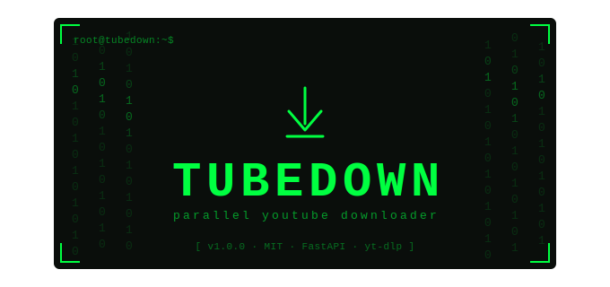

<p align="center">
  
</p>

# Tubedown

A parallel YouTube downloader with a hacker-themed terminal UI, real-time WebSocket progress, and support for both Vue 3 and React frontends.


---

## Table of Contents

- [Features](#features)
- [Project Structure](#project-structure)
- [Requirements](#requirements)
- [Installation](#installation)
- [Authentication](#authentication)
- [Usage](#usage)
- [Configuration](#configuration)
- [Terminal Commands](#terminal-commands)
- [Troubleshooting](#troubleshooting)
- [License](#license)

---

## Features

- **Real-time progress** via WebSocket — live speed, ETA, and status per download
- **Parallel downloads** — up to 3 concurrent downloads by default
- **Terminal-style UI** — Matrix-green aesthetic with a command-driven interface
- **Automatic cookie authentication** — reads from Chrome, Firefox, Edge, Brave, and more
- **Auto-save** — downloads are saved to `~/Downloads/YT-Hacker`
- **Robust error handling** — auto-reconnect on WebSocket drop

---

## Project Structure

```
tubedown/
├── backend.py                  # FastAPI backend with WebSocket support
├── vue-hacker-downloader.vue   # Vue 3 frontend component
├── HackerDownloader.jsx        # React frontend component
├── HackerDownloader.css        # React component styles
└── README.md
```

---

## Requirements

- Python 3.10+
- Node.js 18+ (for frontend)
- [FFmpeg](https://ffmpeg.org/download.html) — required for video/audio merging

---

## Installation

### 1. Install Python dependencies

```bash
pip install fastapi uvicorn yt-dlp websockets browser-cookie3
```

### 2. Start the backend

```bash
python backend.py
```

The backend runs at `http://localhost:8000`.

### 3. Set up the frontend

**Vue 3 (Vite)**

```bash
npm create vite@latest yt-hacker-vue -- --template vue
cd yt-hacker-vue
npm install
```

Copy `vue-hacker-downloader.vue` into `src/components/`, import it in `App.vue`, then:

```bash
npm run dev
```

**React (Vite)**

```bash
npm create vite@latest yt-hacker-react -- --template react
cd yt-hacker-react
npm install
```

Copy `HackerDownloader.jsx` and `HackerDownloader.css` into your project, import the component, then:

```bash
npm run dev
```

Open `http://localhost:5173` in your browser.

---

## Authentication

YouTube requires authentication for some videos. Tubedown automatically reads cookies from your installed browsers — no manual setup needed. Supported browsers: Chrome, Edge, Firefox, Brave, Opera, Opera GX, Vivaldi.

**If automatic detection fails**, export cookies manually:

```bash
yt-dlp --cookies-from-browser chrome
# or export to a file
yt-dlp --cookies cookies.txt "YOUR_URL"
```

Then add the following to `ydl_opts` in `backend.py`:

```python
"cookies": "path/to/cookies.txt"
```

---

## Usage

1. Start the backend: `python backend.py`
2. Start the frontend: `npm run dev`
3. Open `http://localhost:5173`
4. Paste a YouTube URL into the terminal input and press Enter

---

## Configuration

**Backend** — change the download directory in `backend.py`:

```python
DOWNLOAD_DIR = Path.home() / "Downloads" / "YT-Hacker"
```

**Frontend** — adjust the maximum number of parallel downloads:

```javascript
// Vue
const maxParallel = ref(3);

// React
const maxParallel = 3;
```

---

## Terminal Commands

| Command         | Description                        |
|-----------------|------------------------------------|
| `[YouTube URL]` | Start a download                   |
| `help`          | Show the help panel                |
| `clear`         | Clear the terminal output          |
| `/status`       | Check backend and download status  |
| `quit`          | Exit (refreshes the page)          |
| `Ctrl+C`        | Clear the current input            |
| `ESC`           | Close the help panel               |

---

## Troubleshooting

| Issue | Solution |
|-------|----------|
| Backend offline | Run `python backend.py` and ensure port 8000 is free |
| `yt-dlp` not found | Run `pip install yt-dlp` |
| `ffmpeg` not found | Install FFmpeg from [ffmpeg.org](https://ffmpeg.org/download.html) |
| CORS error | Confirm the frontend is connecting to `http://localhost:8000` |
| "Sign in to confirm you're not a bot" | Log into YouTube in your browser; cookies are used automatically |
| No browser cookies detected | Log into YouTube in a supported browser, or use a manual cookie file |
| `browser_cookie3` import error | Run `pip install browser-cookie3` |

---

## License

MIT License — free to use, modify, and distribute. See [LICENSE](LICENSE) for details.
